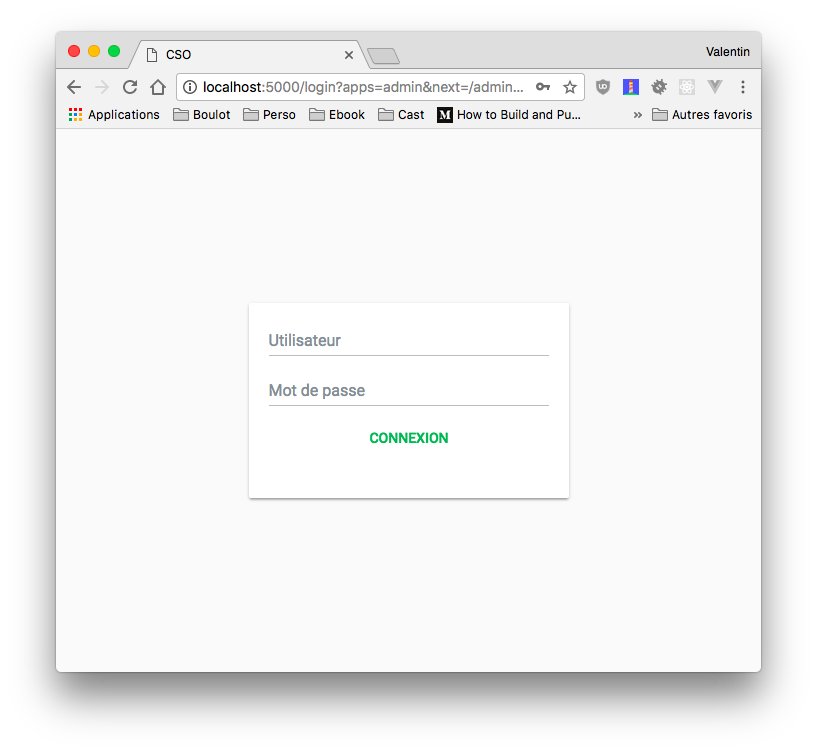
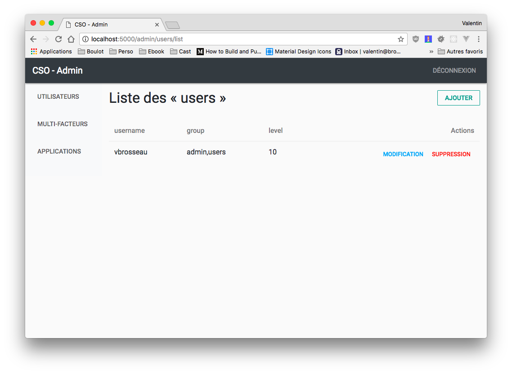
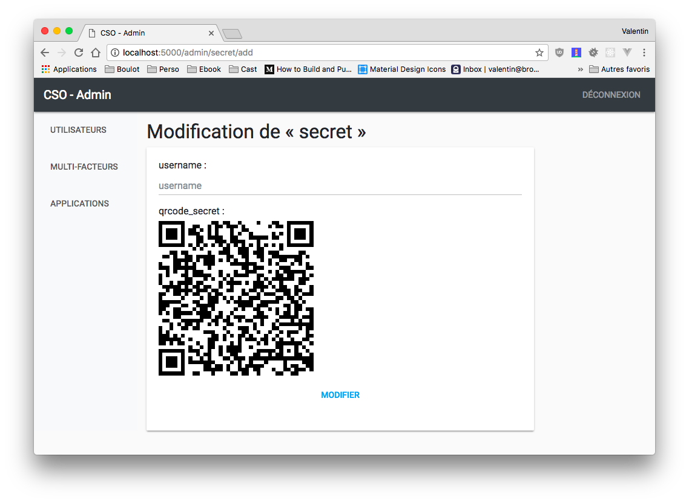

# CSO

CSO is a simple Centralized Sign-on (using to your internal LDAP)

✋ Legacy app i’ve built long time ago… Not perfect but running 24/7 since a looooong time…

<!-- TOC -->

- [CSO](#cso)
    - [Recent and planned changes](#recent-and-planned-changes)
    - [Installation](#installation)
    - [Setup the CSO for your configuration](#setup-the-cso-for-your-configuration)
    - [Login Workflow](#login-workflow)
    - [Run (in dev)](#run-in-dev)
    - [Run in production](#run-in-production)
    - [Nginx Setup](#nginx-setup)
    - [Administration](#administration)

<!-- /TOC -->

- LDAP Auth.
- Timebased OTP for user (Basic implementation)





## Recent and planned changes

- [X] Fix bad CSRF Implementation.
- [X] Update the Design to something more … modern!
- [X] Rewrite login (CSOMain module).
  - [X] Implement TOPT during the login.
- [X] Secret Administration (OTP):
  - [X] Generate.
  - [X] Update.
  - [X] Share via QRCode.
- [X] Implement timedelta checking in
  - [X] Standalone Nginx client.
  - [X] Admin login process.
  - [X] Nginx module.
- [X] Force apps to only accept user with OTP.

## Installation

```shell
pip install -r requirements.txt
```

## Setup the CSO for your configuration

- Change the ```ldap_server``` and the ```ldap_dn``` in the ```parameters.py```.
- Run the ```setup.py```, and enter your « first » admin ```username``` for the CSO. (the username should match with someone on the LDAP server).
- Start the test server ```python run.py```

## Login Workflow

The login workflow is based on a shared secret between the CSO and your « application client ».

We can resume the workflow with :

- Client App : Redirect the user to the CSO (Via an HTML Form).
- CSO : User authenticate (or is already authenticate).
- CSO : Redirection to the « Client App » (Via an HTML Form).
- Client App : Check if data signature is OK, and the time code (to prevent authentication replay).
- Client App : Everything is OK, create the local session in your App.

## Run (in dev)

To test quickly the CSO, just run the following command in your favorite terminal :

```shell
python run.py
```

## Run in production

Since I made this application a long time ago, it’s running from many years in production. I use in my setup UWSGI and NGINX to host the app.

UWSGI Configuration :

```
```

NGINX Configuration :

```
```

## Nginx Setup

Since its not always possible to change the auth mechanism in currents applications, I made a sample configuration to add the CSO on the top layer in most app « the Nginx Proxy server ».

You have two choices :

- The standalone, you have a small script on each server.
- Centralized version, each server must be able to contact the CSO in HTTP to test if the connection is active.

[Follow the Guide](./nginx_auth_request/)

## Administration

The administration is available via the [Web Interface](http://localhost:5000/admin)
